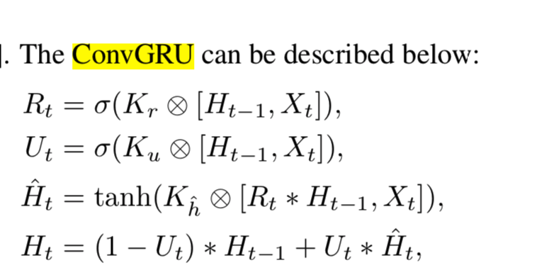
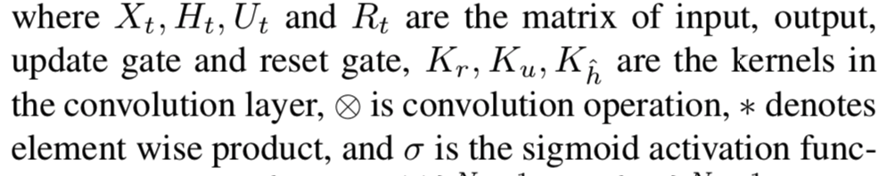
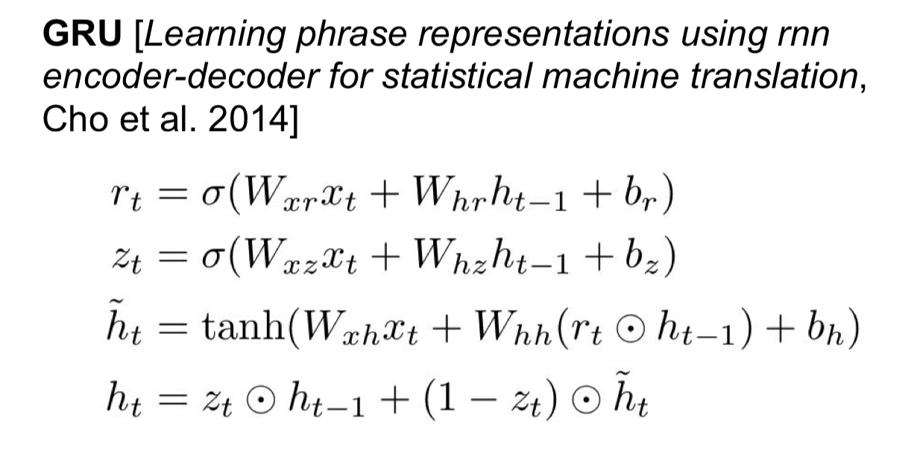
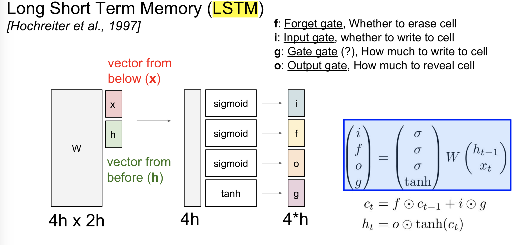

## ConvGRU

A very good animation of RNN, LSTM, GRU:https://towardsdatascience.com/animated-rnn-lstm-and-gru-ef124d06cf45

##### 1. ConvGRU

### 

2. ##### GRU

##### 3.LSTM

4. ##### LSTM gradient flow

5. ##### Vanilla RNN gradient flow