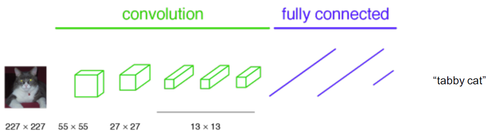
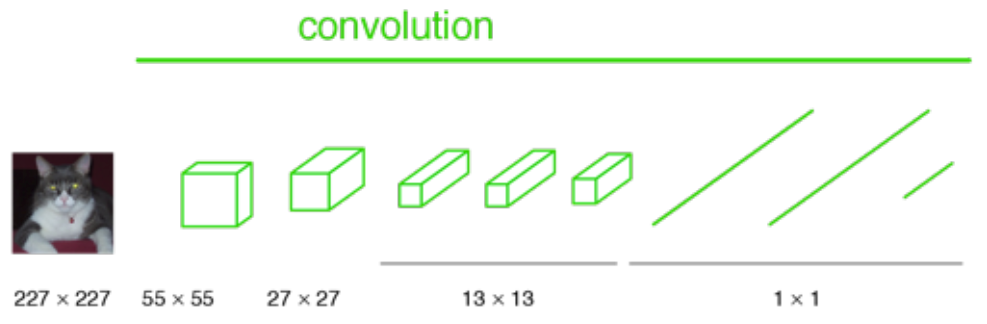
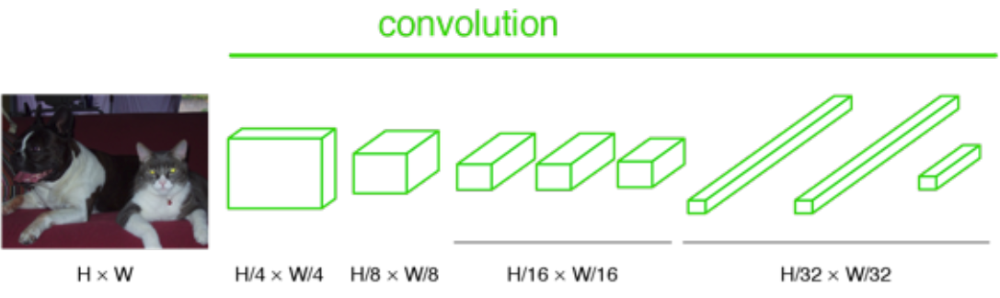
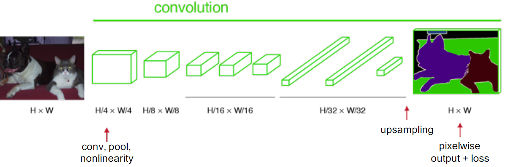
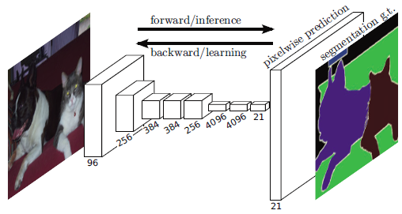
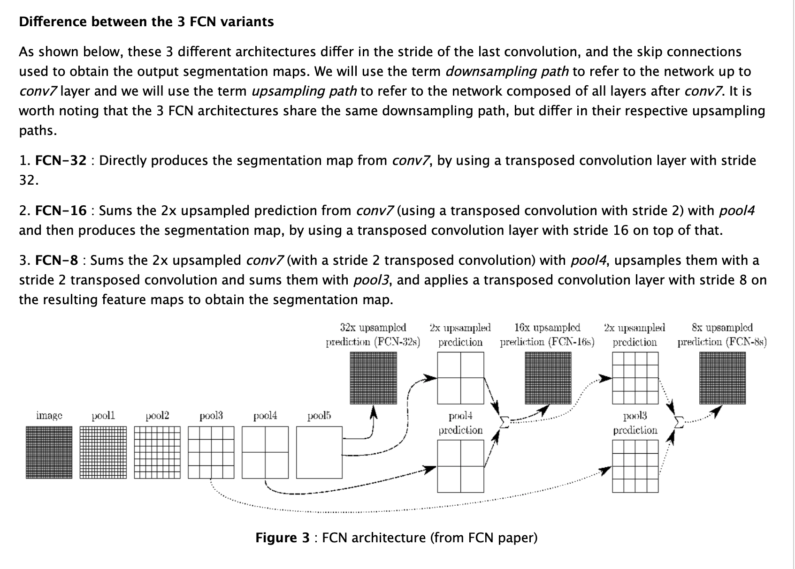

### Fully convolutional network

*****

Fully **convolutional** indicates that the neural network is composed of convolutional layers without any fully-**connected** layers or MLP usually found at the end of the network.

1. #### Why called fully convolutional network?

In classification, conventionally, an input image is downsized and goes through the convolution layers and fully connected (FC) layers, and output one predicted label for the input image, as follows:

Imagine we **turn the FC layers into 1×1 convolutional layers**:

And if the image is not downsized, the output will not be a single label. Instead, the output has a size smaller than the input image (due to the max pooling):

If we upsample the output above, then we can calculate the pixelwise output (label map) as below:

2. #### FCN variants

