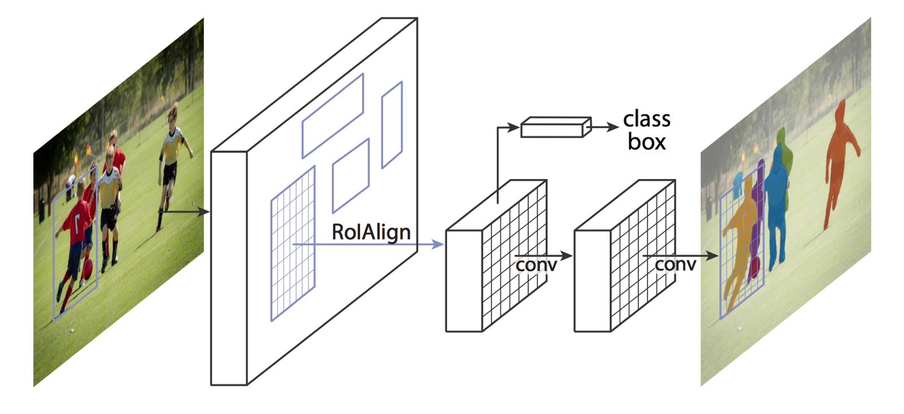
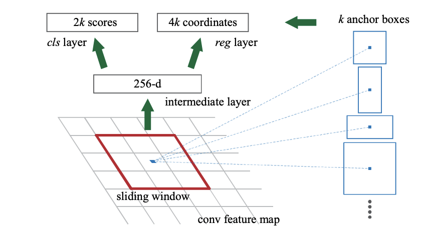

## Mask R-CNN

General steps the approach follows:

1. **Backbone model**: a standard convolutional neural network that serves as a feature extractor. For example, it will turn a1024x1024x3 image into a 32x32x2048 feature map that serves as input for the next layers.

2. **Region Proposal Network (RPN)**: Using regions defined with as many as 200K anchor boxes, the RPN scans each region and predicts whether or not an object is present. One of the great advantages of the RPN is that does not scan the actual image, the network scans the feature map, making it much faster.

   

   This network is fully connected to an n × n spatial window of the input conv feature map. Each sliding window is mapped to a lower-dimensional vector (256-d for ZF and 512-d for VGG). This vector is fed into two sibling fully-connected layers—a box-regression layer (reg)
   and a box-classification layer (cls). Thisarchitecture is naturally implemented with an n × n conv layer followed by two sibling 1 × 1 conv layers (for reg and cls, respectively). ReLUs [15] are applied to the output of the n × n conv layer.

   

3. **Region of Interest Classification and Bounding Box:** In this step the algorithm takes the regions of interest proposed by the RPN as inputs and outputs a classification (softmax) and a bounding box (regressor).

4. **Segmentation Masks**: In the final step, the positive ROI regions are taken in as inputs and 28x28 pixel masks with float values are generated as outputs for the objects. During inference, these masks are scaled up.