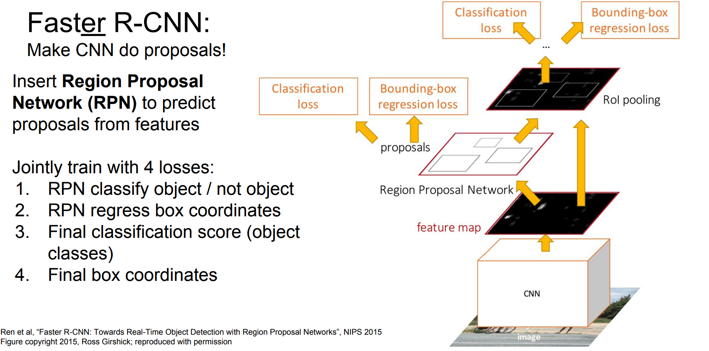
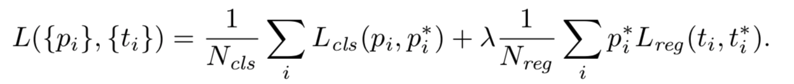
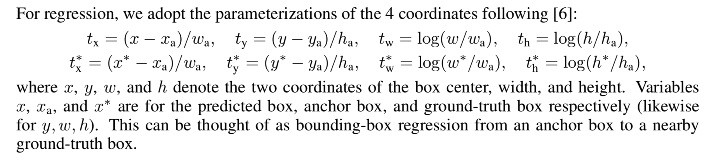

## Faster R-CNN

### Approach

------

#### 1. RPN

To generate region proposals, we slide a small network over the conv feature map output by the last
shared conv layer. This network is fully connected to an n × n spatial window of the input conv feature map. Each sliding window is mapped to a lower-dimensional vector (256-d for ZF and 512-d
for VGG). This vector is fed into two sibling fully-connected layers—a box-regression layer (*reg*)
and a box-classification layer (*cls*). We use n = 3 in this paper, noting that the effective receptive
field on the input image is large (171 and 228 pixels for ZF and VGG, respectively). This mini-
network is illustrated at a single position in Fig. 1 (left). Note that because the mini-network operates
in a sliding-window fashion, the fully-connected layers are shared across all spatial locations. This
architecture is naturally implemented with an n × n conv layer followed by two sibling 1 × 1 conv
layers (for *reg* and *cls*, respectively). ReLUs [15] are applied to the output of the n × n conv layer.

##### Translation-Invariant Anchors

At each sliding-window location, we simultaneously predict k region proposals, so the *reg* layer
has 4k outputs encoding the coordinates of k boxes. The *cls* layer outputs 2k scores that estimate
probabilityofobject/not-objectforeachproposal.2 Thekproposalsareparameterized*relative*to
k reference boxes, called *anchors*. Each anchor is centered at the sliding window in question, and is
associated with a scale and aspect ratio. We use 3 scales and 3 aspect ratios, yielding k = 9 anchors
at each sliding position. For a conv feature map of a size W × H (typically ∼2,400), there are W H k
anchors in total.

##### A Loss Function for Learning Region Proposals

For training RPNs, we assign a binary class label (of being an object or not) to each anchor. We
assign a positive label to two kinds of anchors: (i) the anchor/anchors with the highest Intersection-
over-Union (IoU) overlap with a ground-truth box, or (ii) an anchor that has an IoU overlap higher
than 0.7 with any ground-truth box. Note that a single ground-truth box may assign positive labels
to multiple anchors. We assign a negative label to a non-positive anchor if its IoU ratio is lower than
0.3 for all ground-truth boxes. Anchors that are neither positive nor negative do not contribute to the
training objective.

Our loss function for an image is defined as:

Here, i is the index of an anchor in a mini-batch and pi is the predicted probability of anchor i being
anobject.Theground-truthlabelp∗i is1iftheanchorispositive,andis0iftheanchorisnegative.ti
isavectorrepresentingthe4parameterizedcoordinatesofthepredictedboundingbox,andt∗i isthat
of the ground-truth box associated with a positive anchor. The classification loss Lcls is log loss over
two classes (object *vs.* not object). For the regression loss, we use Lreg (ti, ti∗ ) = R(ti − ti∗ ) where
R is the robust loss function (smooth L1). The term pi∗ Lreg means the regression loss
is activated only for positive anchors (pi∗ = 1) and is disabled otherwise (pi∗ = 0). The outputs of
the *cls* and *reg* layers consist of {pi } and {ti} respectively. The two terms are normalized with Ncls
and Nreg , and a balancing weight λ.

##### Training Agorithm and Sharing Convolutional Features for Region Proposal and Object Detection

In the first step, we train the RPN as described above. This network is initialized with an ImageNet-
pre-trained model and fine-tuned end-to-end for the region proposal task. In the second step, we
train a separate detection network by Fast R-CNN using the proposals generated by the step-1 RPN.
This detection network is also initialized by the ImageNet-pre-trained model. At this point the two
networks do not share conv layers. In the third step, we use the detector network to initialize RPN
training, but we fix the shared conv layers and only fine-tune the layers unique to RPN. Now the two
networks share conv layers. Finally, keeping the shared conv layers fixed, we fine-tune the fc layers
of the Fast R-CNN. As such, both networks share the same conv layers and form a unified network.

