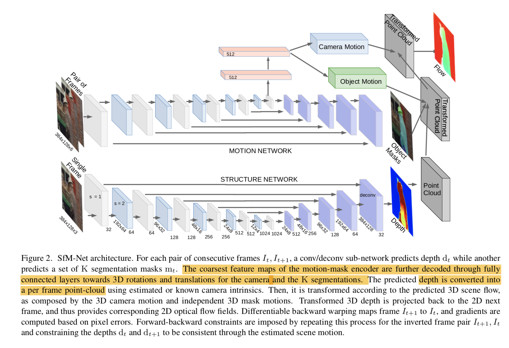
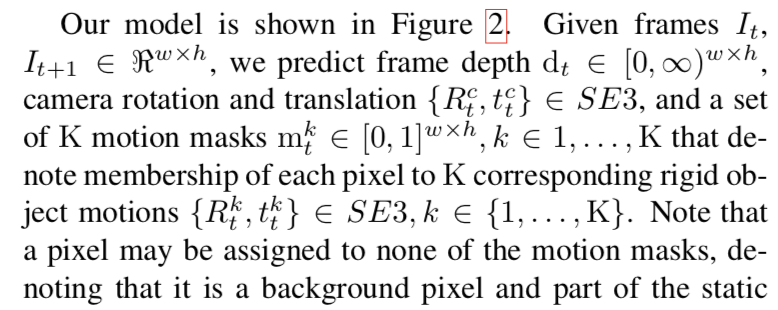
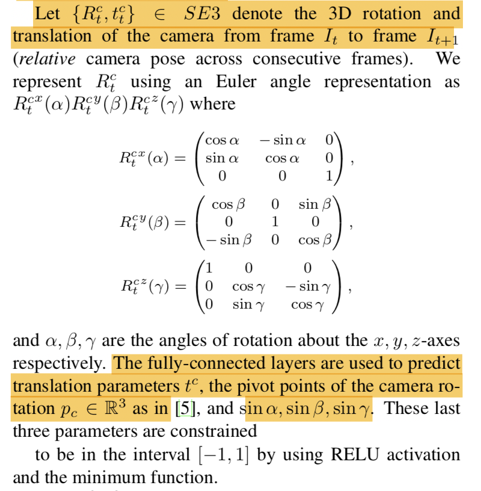
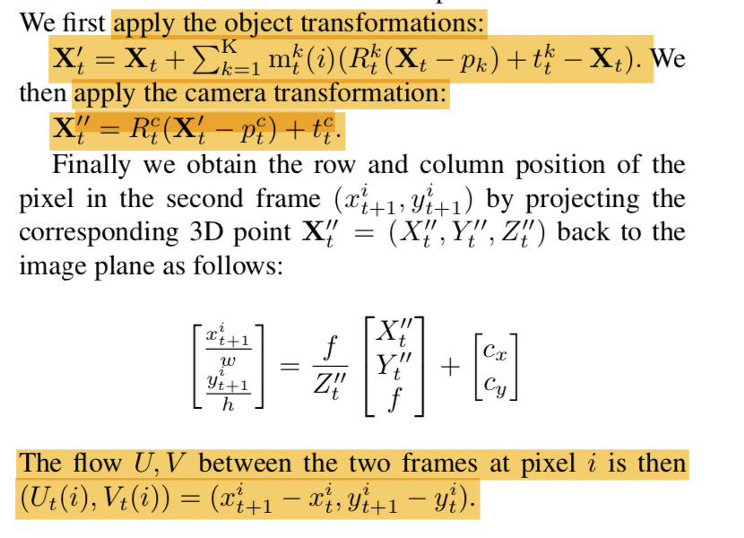
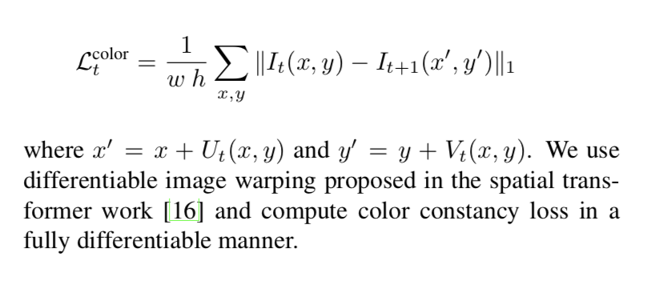
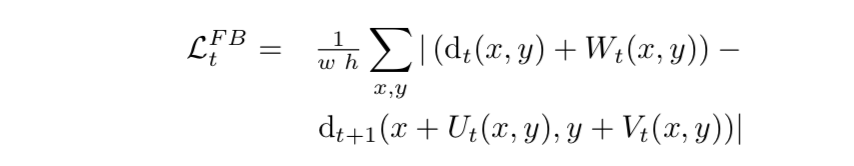

## Learning of Structure and Motion of Video

### Approach

------

Network Architecture

​                  world.

### 1. Depth map to Point cloud per frame

each pixel in depth map corresponds to a 3D coordinate. See 3.1 in paper for details.

### 2. Camera Motion

We depth-concatenate the pair of frames and use a series of convolutional layers to produce an embedding layer. We use two fully-connected layers to predict the motion of the camera between the frames and a predefined number K of rigid body motions that explain moving objects in the scene.

### 3. Object Masks Motion

Similar to above. 

Difference: While camera motion is a global transformation applied to all the pixels in the scene, the object motion transforms are weighted by the predicted membership probability of each pixel to each rigid motion, mkt< ∈ [0,1]h×w , k ∈ {1, . . . , K}. These masks are produced by feeding the embedding layer through a deconvolutional tower. K = 3 in this paper.

### 4. Optical flow

### 5. Loss function

#### 1. self supervision 

##### a. Smoothies penalty (L1 regularization) on : depth map, object masks, optical flow map

##### b. Forward-backward consistency constraints.

but not empirical gains for doing so.

##### c. Supervising depth. Supervising camera motion. Supervising optical flow and object motion. See paper for detailed loss functions.

#### 2. 

