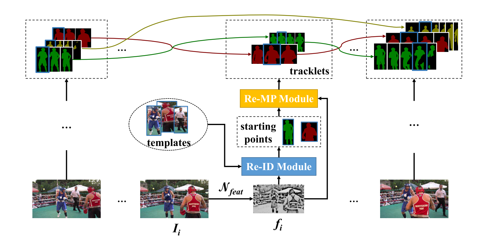
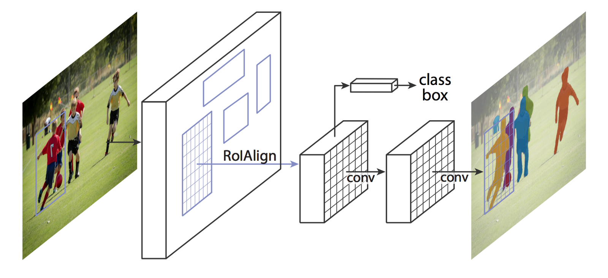

## **Paper Notes**

## Video Object Segmentation

 

| No.  |              Figure              | Title                                                        |                     Task                     |     Pub.      |                            Links                             |                        Implementation                        |
| :--- | :------------------------------: | ------------------------------------------------------------ | :------------------------------------------: | :-----------: | :----------------------------------------------------------: | :----------------------------------------------------------: |
|      |          | __place holder__                                             |                 place holder                 | __CVPR 2017__ |            [`note`]() [`paper`]() [`projpage`]()             |                        [`Pytorch`]()                         |
| 6    |            | __(AGS) Learning Unsupervised Video Object Segmentation through Visual Attention__ |       Unsupervised VOS, single object        | __CVPR 2019__ | [`note`](./AGS/AGS.md) [`paper`](https://www.researchgate.net/publication/332751903_Learning_Unsupervised_Video_Object_Segmentation_through_Visual_Attention) |        [`Caffe`](https://github.com/wenguanwang/AGS)         |
| 5    |  | __(SiamMask) Fast Online Object Tracking and Segmentation: A Unifying Approach__ | VOS+VOT given first frame box, single object | __CVPR 2019__ | [`note`](./SiamMask/SiamMask.md) [`paper`](https://arxiv.org/pdf/1812.05050.pdf) [`projpage`](http://www.robots.ox.ac.uk/~qwang/SiamMask) |      [`Pytorch`](https://github.com/foolwood/SiamMask)       |
| 4    |        | __(OSVOS) One-Shot Video Object Segmentation__               |      Semi-supervised VOS, single object      | __CVPR 2017__ | [`note`](https://github.com/jjjjchen/Notes/blob/master/Paper%20Notes/VOS/OSVOS/OSVOS.md) [`paper`](https://arxiv.org/pdf/1611.05198v4.pdf) [`projpage`](http://www.vision.ee.ethz.ch/~cvlsegmentation/osvos/) | [`Pytorch`](https://github.com/kmaninis/OSVOS-PyTorch) [`tensorflow`](https://github.com/scaelles/OSVOS-TensorFlow) |
| 3    |          | __(LVO) Learning Video Object Segmentation with Visual Memory__ |       Unsupervised VOS, single object        | __ICCV 2017__ | [`note`](./LVO/LVO.md) [`paper`](https://arxiv.org/pdf/1704.05737.pdf) [`projpage`](http://thoth.inrialpes.fr/research/lvo/) | [`Torch`](http://thoth.inrialpes.fr/research/lvo/iccv.tar.gz) |
| 2    |      | __(DyeNet) Video Object Segmentation with Joint Re-identification and Attention-Aware Mask Propagation__ |       Semi-supervisd VOS, multi-object       | __ECCV 2018__ | [`note`](./DyeNet/DyeNet.md) [`paper`](http://openaccess.thecvf.com/content_ECCV_2018/papers/Xiaoxiao_Li_Video_Object_Segmentation_ECCV_2018_paper.pdf) |                                                              |
| 1    |    | __(PReMVOS) PReMVOS: Proposal-generation, Refinement and Merging for Video Object Segmentation__ |             Semi-supervised VOS              | __ACCV 2018__ | [`note`](./PReMVOS/PReMVOS.md) [`paper`](https://arxiv.org/pdf/1807.09190.pdf) [`github`](https://github.com/JonathonLuiten/PReMVOS) |    [`Pytorch`](https://github.com/JonathonLuiten/PReMVOS)    |

## Instance Segmentation

 

| No.  |                 Figure                 | Title            |         Task          |     Pub.      |                            Links                             |                  Implementation                   |
| :--- | :------------------------------------: | ---------------- | :-------------------: | :-----------: | :----------------------------------------------------------: | :-----------------------------------------------: |
|      |                | __place holder__ |     place holder      | __CVPR 2017__ |            [`note`]() [`paper`]() [`projpage`]()             |                   [`Pytorch`]()                   |
|      |  | __Faster RCNN__  |     place holder      | __CVPR 2017__ | [`note`](https://github.com/jjjjchen/Notes/tree/master/Paper%20Notes/Other%20papers/faster%20R-CNN) [`paper`](<https://papers.nips.cc/paper/5638-faster-r-cnn-towards-real-time-object-detection-with-region-proposal-networks.pdf>) [`projpage`]() |                   [`Pytorch`]()                   |
|      |        | __Mask RCNN__    | Instance segmentation | __ICCV 2017__ | [`note`](https://github.com/jjjjchen/Notes/tree/master/Paper%20Notes/Other%20papers/Mask%20R-CNN) [`paper`](<https://arxiv.org/pdf/1703.06870v3.pdf>) | [`Pytorch`](<https://github.com/delldu/MaskRCNN>) |

## Optical Flow

| No.  |          Figure          | Title            |     Task     |     Pub.      |                 Links                 | Implementation |
| :--- | :----------------------: | ---------------- | :----------: | :-----------: | :-----------------------------------: | :------------: |
|      |  | __place holder__ | place holder | __CVPR 2017__ | [`note`]() [`paper`]() [`projpage`]() | [`Pytorch`]()  |

