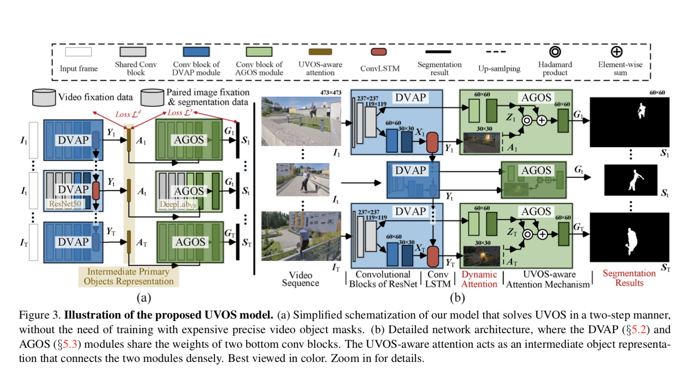
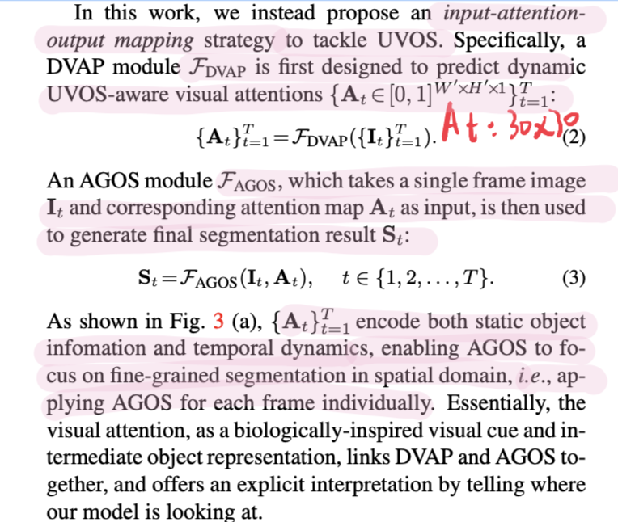
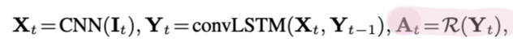
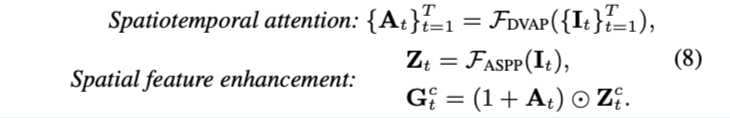
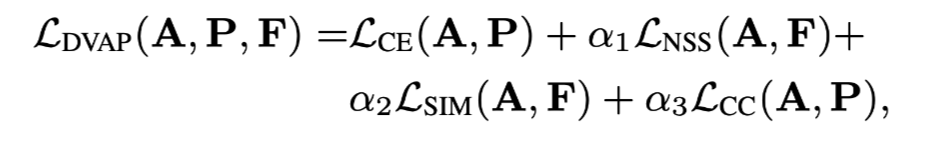

## **(AGS) Learning Unsupervised Video Object Segmentation through Visual Attention**

### Approach

------

#### Network Architecture

we decompose UVOS into two sub-tasks: **dynamic visual attention prediction (DVAP)** and **attention- guided object segmentation (AGOS)**.

**DAVP**:

The DVAP module is built on a CNN-convLSTM archi- tecture, where the CNN layers are borrowed from the first five convolutional blocks of ResNet101. 

ConvLSTM is favored here as it preserves spatial details as well as modeling temporal dynamics simultaneously. Our DVAP module can be formulated as follows: 

 where Yt indicates the 3D-tensor hidden state (with 32 channels) of convLSTM at time step t. R is a readout func- tion that produces the attention map from the hidden state, implemented as a 1×1 convolution layer with the sigmoid activation function.

**AGOS**:

The AGOS module is also built upon convolutional blocks of ResNet101 and modified with the ASPP module proposed in DeepLabV 3. With an input frame image I_t ∈ R^473 × 473 × 3, a segmentation feature Z_t ∈ R^60 × 60 × 1536 can be extracted from the ASPP module. 

**Component loss function**:

Let {I, S, P, F, M} denote a training sample in the image training batch, which includes a static image I and final segmentation prediction S, corresponding ground-truth (i.e., continuous attention map P, binary fixation map F, and segmentation mask M). The overall loss function combines both LDVAPand LAGOS:

#### ***Loss= LDVAP(A, P, F) + LAGOS(S, M)***

where 

#### ***LAGOS(S, M) = LCE(S, M)***

### Results

------

the proposed model outperforms other competitors over most metrics across all the datasets.

#### Drawback:

Need extra fixation data for training attention part, a bit cheating