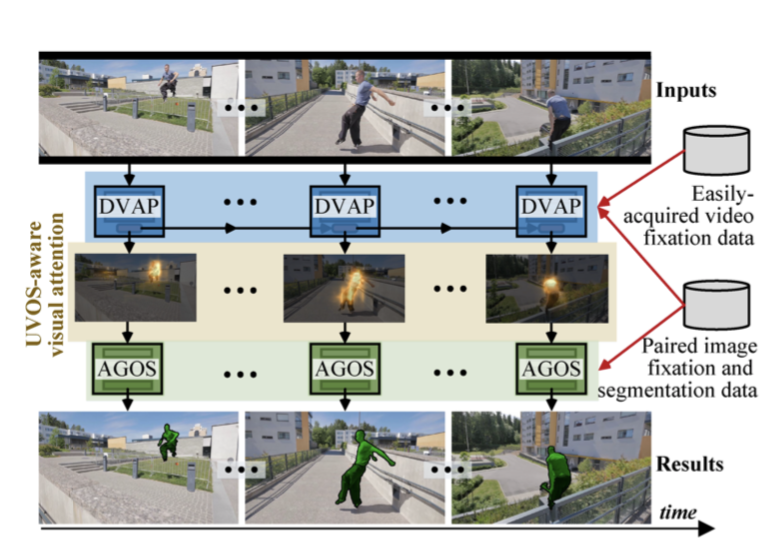
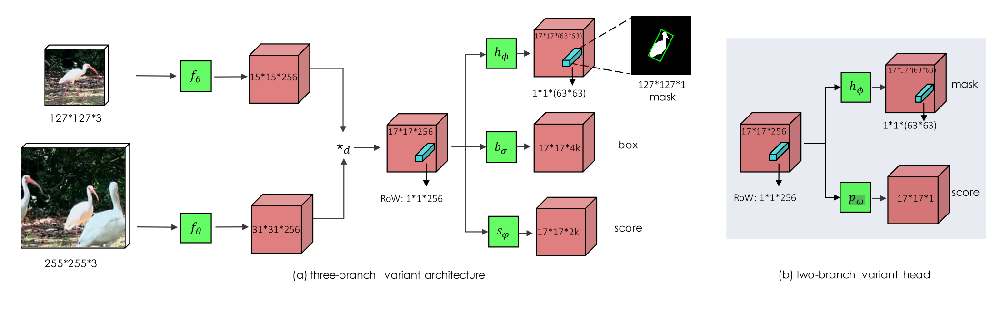
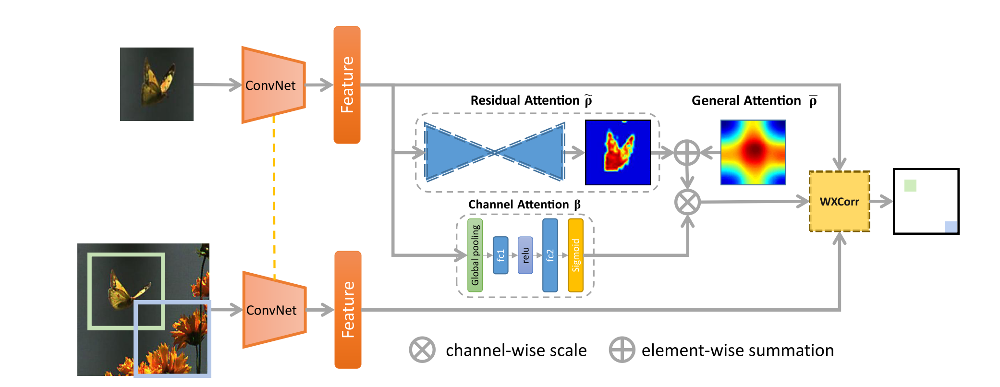
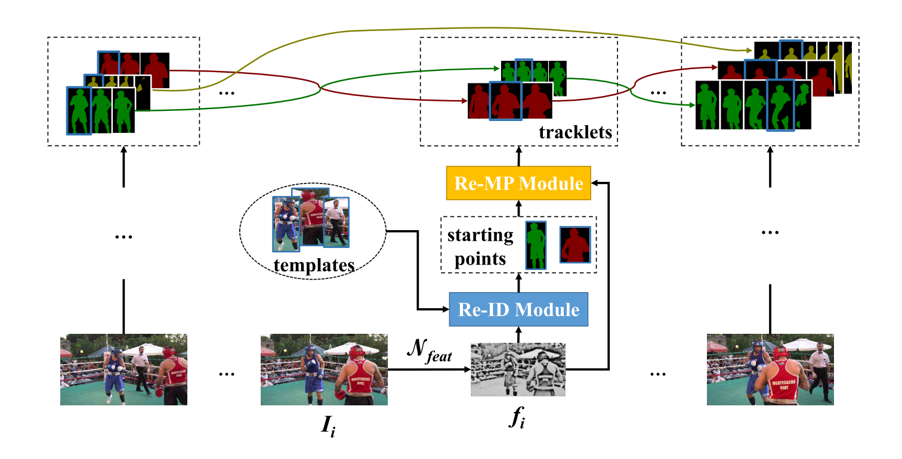

## Video Object Segmentation

### 

| No.  |              Figure              | Title                                                        |                     Task                     |     Pub.      |                            Links                             |                        Implementation                        |
| :--- | :------------------------------: | ------------------------------------------------------------ | :------------------------------------------: | :-----------: | :----------------------------------------------------------: | :----------------------------------------------------------: |
| 4    |          | __place holder__                                             |                 place holder                 | __CVPR 2017__ |            [`note`]() [`paper`]() [`projpage`]()             |                        [`Pytorch`]()                         |
| 8    |            | __(AGS) Learning Unsupervised Video Object Segmentation through Visual Attention__ |       Unsupervised VOS, single object        | __CVPR 2019__ |      [`note`](./AGS/AGS.md) [`paper`]() [`projpage`]()       |        [`Caffe`](https://github.com/wenguanwang/AGS)         |
| 7    |  | __(SiamMask) Fast Online Object Tracking and Segmentation: A Unifying Approach__ | VOS+VOT given first frame box, single object | __CVPR 2019__ | [`note`](./SiamMask/SiamMask.md) [`paper`](https://arxiv.org/pdf/1812.05050.pdf) [`projpage`](http://www.robots.ox.ac.uk/~qwang/SiamMask) |      [`Pytorch`](https://github.com/foolwood/SiamMask)       |
| 6    |      | __(RASNet) Learning Attentions: Residual Attentional Siamese Network for High Performance Online Visual Tracking__ |                     VOT                      | __CVPR 2018__ |            [`note`]() [`paper`]() [`projpage`]()             |                        [`Pytorch`]()                         |
| 5    |            (to read)             | __MaskRNN__                                                  |                 Multi-object                 | __NIPS 2017__ |            [`note`]() [`paper`]() [`projpage`]()             |                        [`Pytorch`]()                         |
| 4    |        | __(OSVOS) One-Shot Video Object Segmentation__               |      Semi-supervised VOS, single object      | __CVPR 2017__ | [`note`](./OSVOS/OSVOS.md) [`paper`](https://arxiv.org/pdf/1611.05198v4.pdf) [`projpage`](http://www.vision.ee.ethz.ch/~cvlsegmentation/osvos/) | [`Pytorch`](https://github.com/kmaninis/OSVOS-PyTorch) [`tensorflow`](https://github.com/scaelles/OSVOS-TensorFlow) |
| 3    |          | __(LVO) Learning Video Object Segmentation with Visual Memory__ |       Unsupervised VOS, single object        | __ICCV 2017__ | [`note`](./LVO/LVO.md) [`paper`](https://arxiv.org/pdf/1704.05737.pdf) [`projpage`](http://thoth.inrialpes.fr/research/lvo/) |                             lua                              |
| 2    |      | __(DyeNet) Video Object Segmentation with Joint Re-identification and Attention-Aware Mask Propagation__ |       Semi-supervisd VOS, multi-object       | __ECCV 2018__ | [`note`](./DyeNet/DyeNet.md) [`paper`](http://openaccess.thecvf.com/content_ECCV_2018/papers/Xiaoxiao_Li_Video_Object_Segmentation_ECCV_2018_paper.pdf) |                                                              |
| 1    |    | __(PReMVOS) PReMVOS: Proposal-generation, Refinement and Merging for Video Object Segmentation__ |             Semi-supervised VOS              | __ACCV 2018__ | [`note`](./PReMVOS/PReMVOS.md) [`paper`](https://arxiv.org/pdf/1807.09190.pdf) [`github`](https://github.com/JonathonLuiten/PReMVOS) |    [`Pytorch`](https://github.com/JonathonLuiten/PReMVOS)    |

