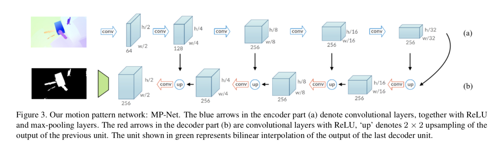
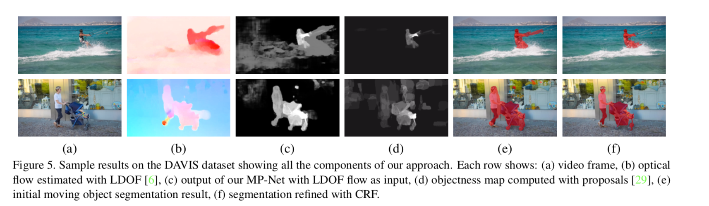
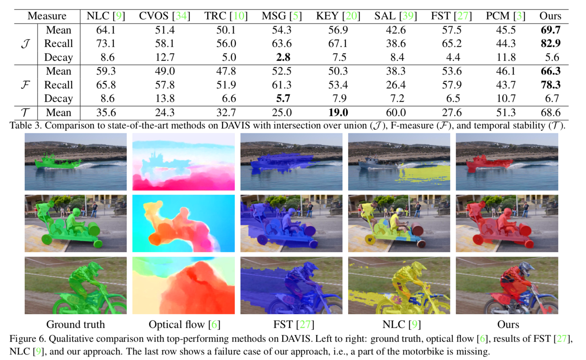

## Learning motion patterns in videos

### Approach

------

##### Network Architecture

Output of the MP-Net is a map with the original resolution, each pixel ∈ [0, 1] to denote the probability of being in motion.

##### Training with synthetic data

Train with the synthetic FlyingThings3D dataset. Ground-truth optical flow, disparity, intrinsic and extrinsic camera parameers, and object instance segmentation masks are provided for all the videos. No annotation for motion map, which is required to train the network. 

So the paper provide a way to extract this data from the dataset. Details in paper.

##### VOS in real data:

We first compute optical flow with popular methods (e.g. LDOF). With this flow as input to the network, we estimate a motion label map, as shown in the examples in Figure 5(c).

Compute objectness map from object proposals: 

1. the score at a pixel i is the number of proposals that include it.
2. normalisze by the total number of proposals to obtain oi.
3. combine this with the motion prediction output of MP-Net at pixel i, mi ∈ [0, 1], to obtain an updated prediction pi as: pi =min(mi ∗(k+oi),1). where k∈[0,1] is a parameter controlling the influence of objectness. 
4. refine with CRF. 

### Results

------

PS: State of art is 79.7 (AGS) for unsupervised VOS task.