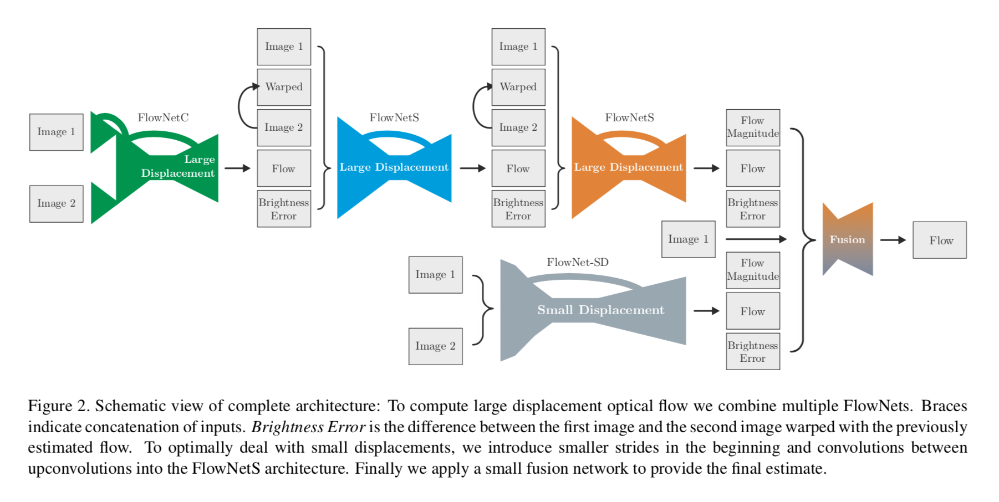
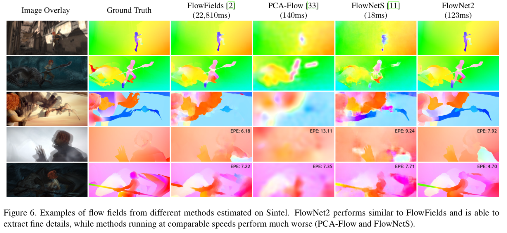
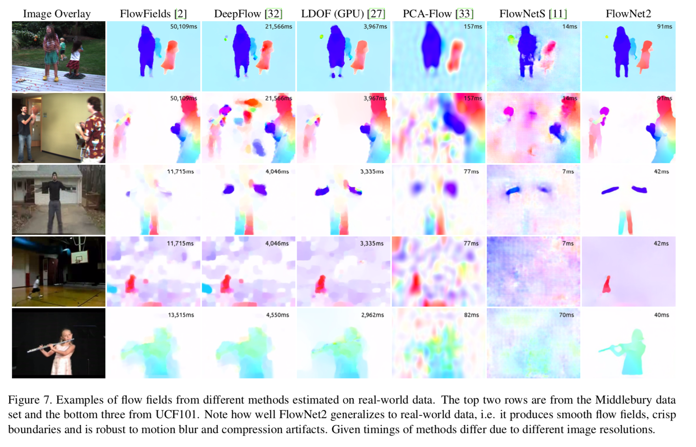

## FlowNet2.0

### Abstract

------

Problem: end-to-end learning of optical flow estimatimation in a learning problem

### Approach

------

Network Architecture

### Results

------

while the results on Middlebury indicate imperfect performance on subpixel motion, FlowNet 2.0 results highlight very crisp motion boundaries, retrieval of fine structures, and robustness to compression artifacts.

