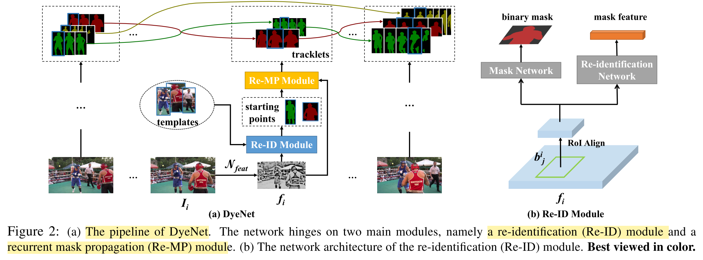
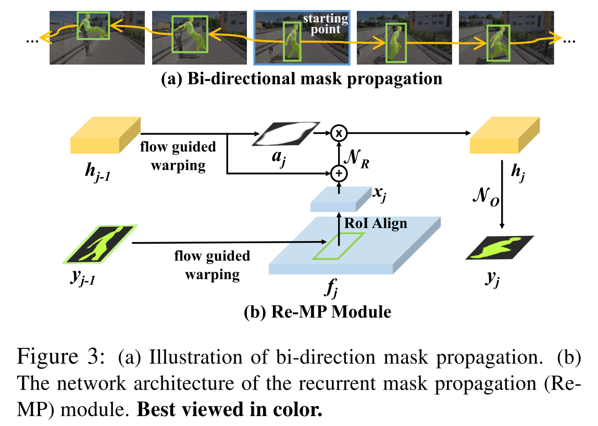

## Video Object Segmentation with Joint Re-identification and Attention-Aware Mask Propagation

### Abstract

------

* Probelm: 

  **Semi-supervised video object segmentation：**

  **(the ground truth mask for the first video frame is given)**

  The task of automatically generating accurate and consistent pixel masks for multiple objects in a video sequence, given the first-frame ground truth annotations.

* Method: **DyeNet**: Re-ID + Re-MP

* Results:  **J&F mean score of 73.8** on the test-challenge dataset DAVIS 2018

### Introduction (**PReMVOS algorithm** Overview) 

------

Our network hinges on two main modules, namely a re-identification **(Re-ID)** module and a recurrent mask propagation **(Re-MP)** module. 

The **Re-ID module helps to establish confident starting points** in non-successive frames and retrieve missing segments caused by occlusions. 

​	solve problem 1: Multiple objects -> occlusion

Based on the segments provided by the Re-ID module, **the Re-MP module propagates their masks bidirectionally** by a recurrent neural network to the entire video. Attention mechanism makes the Re-MP module more resilient to distractors.

​	solve problem 2: Variations in both scale and pose across frames.

### Approach

***

1. **Feature extraction:**

   for each frame Ii, we first extract a feature fi by a convolutional feature network N_feat, i.e., fi = Nfeat(Ii). Both Re-ID and Re-MP modules employ the same set of features. We use ‘conv1’ to ‘conv4_x’ of ResNet-101 as the backbone of N_feat

2. **Iterative inference with template expansion.**

   In the first iteration, the Re-ID module generates a set of masks from object proposals and compares them with ground-truth templates given in the first frame. Masks with a high similarity to templates are chosen as the starting points for Re-MP. Subsequently, Re-MP propagates each selected mask (i.e., starting point) bidirectionally, and generates a sequence of segmentation masks, which we call tracklet.

   In subsequent iterations, DyeNet chooses confidently predicted masks to expand the template set and reapplies Re-ID and Re-MP

   - **Re-identification **

     By computing the cosine similarities between the mask and template features. If a candidate bounding box is sufficiently similar to any template, we will keep its mask as a starting point for mask propagation.

     **‘conv5_x**’ block of ResNet-101 as the backbone of the two sub-networks.

   - **Recurrent Mask Propagation**

     we bi-directionally extend the retrieved masks (i.e., starting points) to form tracklets by us- ing the Re-MP module.  

3. **The overall loss function of DyeNet** is formulated as: L = Lreid + λ(Lmask + Lremp), where Lreid is the re-identification loss of re-identification network, which follows Online Instance Matching (OIM) loss. Lmask and Lremp indicate the pixel-wise segmentation losses of the mask network in Sec. 3.1 and recurrent mask propagation module in Sec. 3.2. The