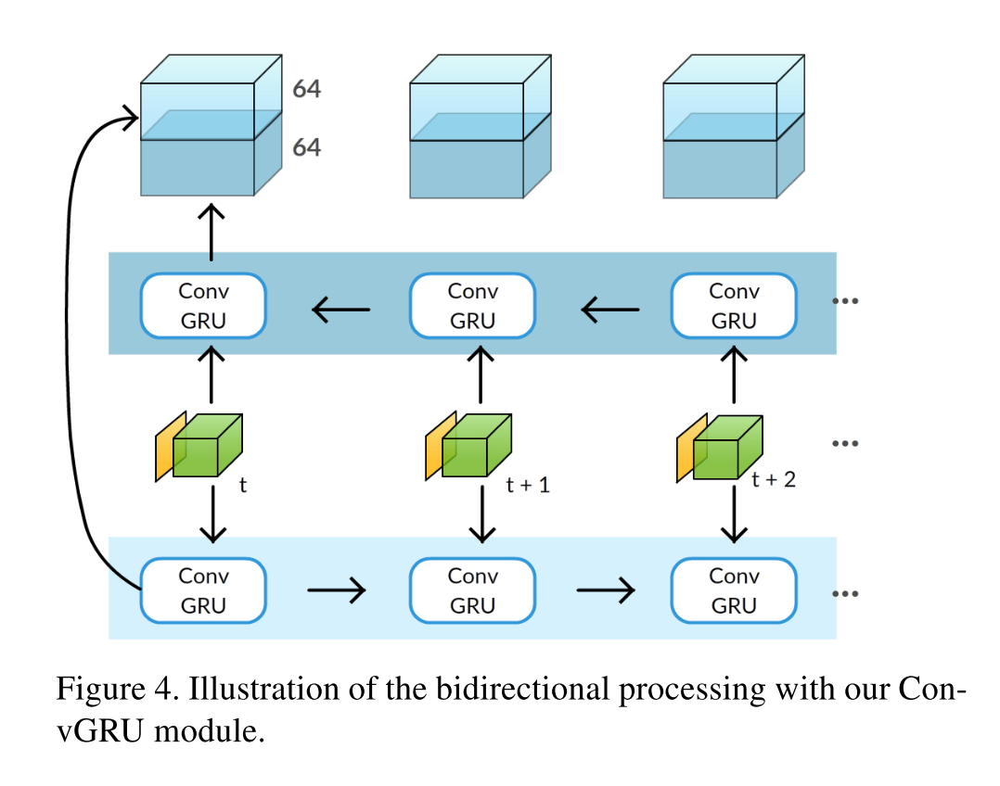

## Learning Video Object Segmentation with Visual Memory

### Abstract

------

Problem: Unsupervised VOS. single object.

Proposed Method: 

A novel two-stream neural network with an explicit memory module. The two streams of the network encode spatial and temporal features in a video sequence re- spectively, while the memory module captures the evolu- tion of objects over time. The module to build a “visual memory” in video, i.e., a joint representation of all the video frames, is realized with a convolutional recurrent unit learned from a small number of training video sequences. The visual memory is implemented with convolutional gated recurrent units, which allows to propagate spatial information over time. 

Given a video frame as input, our approach assigns each pixel an object or background label. No multi object annotation.

Result: J mean 75.9

### Approach

------

**Appearance Network**

It takes an RGB frame as input and produces a 128 × w/8 × h/8 feature representation. We use a state-of-the-art CNN for this stream, namely the largeFOV version of the DeepLab network. It is pretrained on a semantic segmentation dataset, PASCAL VOC 2012, resulting in features that can distinguish objects from background as well as from each other. We extract features from the fc6 layer of the network, which has a feature dimension of 1024 for each pixel. This feature map is further passed through two 1 × 1 convolutional layers, interleaved with tanh non-linearities, to reduce the dimension to 128. These newly-added layers are trained together with ConvGRU.

**Motion Network** 

For the temporal stream we employ MP- Net, a CNN pretrained for the motion segmentation task. It is trained to estimate independently moving objects (i.e., irrespective of camera motion) based on optical flow computed from a pair of frames as input (shown in yellow in Figure 2). This stream produces a w/4×h/4 motion prediction output, where each value represents the likelihood of the corresponding pixel being in motion. Its output is further downsampled by a factor 2 (in w and h) to match the dimensions of the appearance stream output.

**Memory Module**

It takes the concatenation of appearance and motion stream outputs as its input. The output of this ConvGRU memory module is a 64×w/8×h/8 feature map obtained by combining the two-stream input with the internal state of the memory module. 

ConvGRU: 

We further improve the model by processing the video bidirectionally. It is composed of two ConvGRU instances with identical learned weights, which are run in parallel. The first one processes frames in the forward direction, starting with the first frame (shown at the bottom in the figure). The second instance process frames in the backward direction, starting with the last video frame (shown at the top in the figure). The activations from these two directions are concatenated at each time step, as shown in the figure, to pro- duce a 128×w/8×h/8 output. It is then passed through a 3×3 convolutional layer to finally produce a 64×w/8×h/8 for each frame. Pixel-wise segmentation is then obtained with a final 1×1 convolutional layer and a softmax nonlinearity, as in the unidirectional case. Bidirectional

