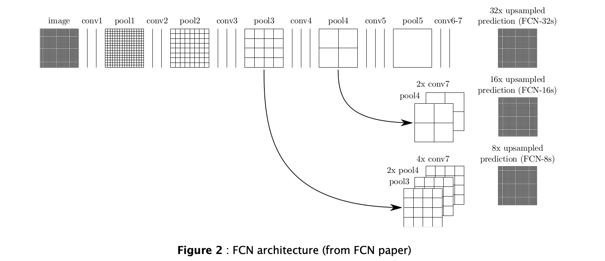
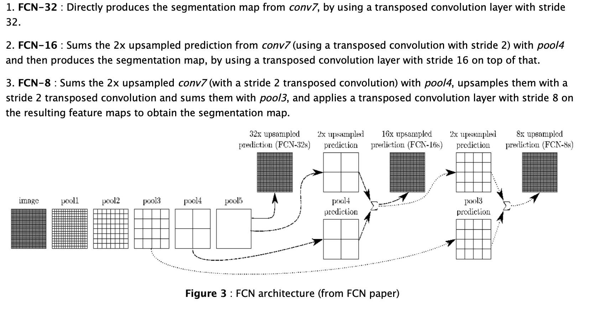
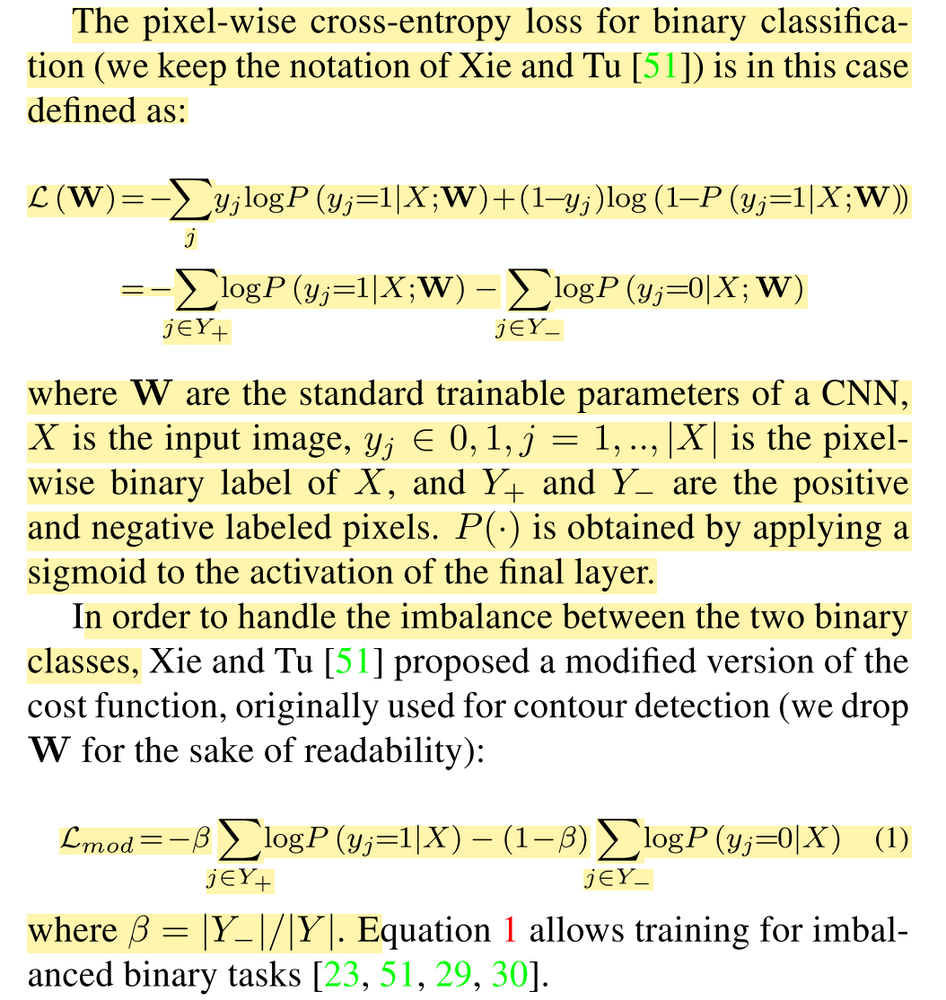
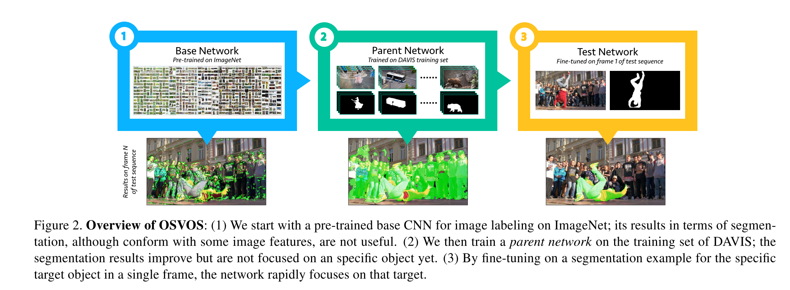
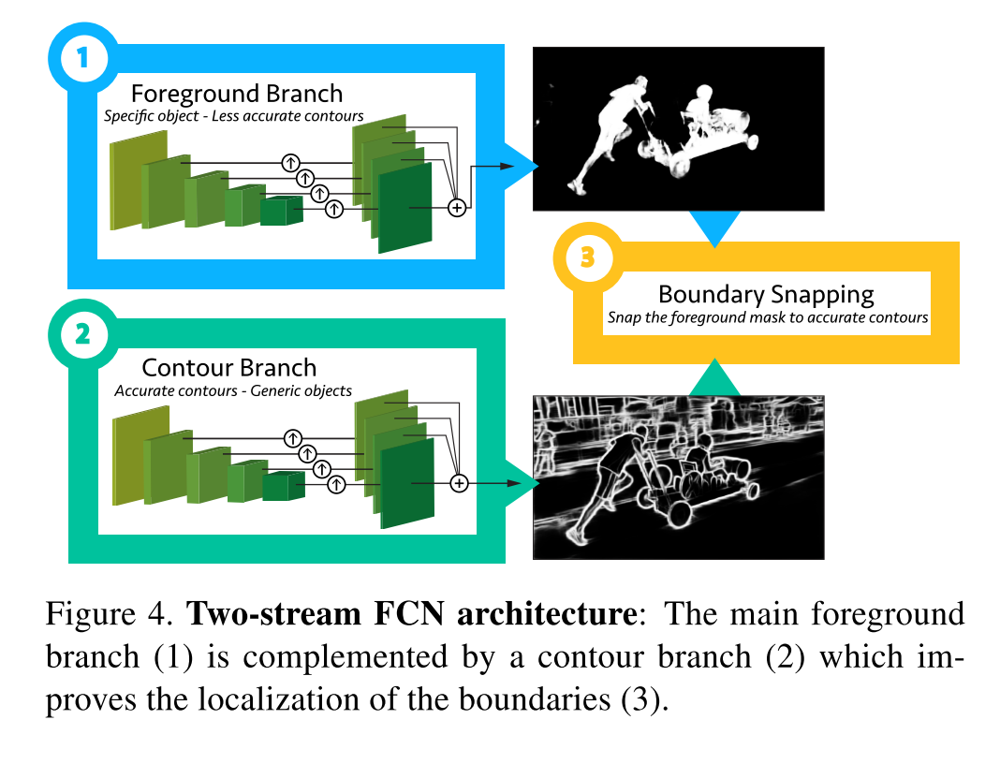

## **One-Shot Video Object Segmentation**

### Abstract

------

Problem: semi-supervised VOS, single object
Proposed Method: a fully-convolutional neural network architecture that is able to successively transfer generic semantic information, learned on ImageNet, to the task of foreground segmentation, and finally to learning the appearance ofa single annotated object of the test sequence (hence one-shot). 

Although all frames are processed independently, the results are temporally coherent and stable. 

Result: J mean 79.8%

### Approach

------

we adapt a CNN(VGG) pre-trained on image recognition to video object segmentation. This is achieved by training it on a set of videos with manually segmented objects (achieve foreground segmentation). Finally, it is fine-tuned at test time on a specific object that is manually segmented in a single frame.

**1. foreground FCN**

The VGG architecture consists of groups of convolutional plus Rectified Linear Units (ReLU) layers grouped into 5 stages. Between the stages, pooling operations downscale the feature maps as we go deeper into the network. The fully-connected layers needed for classification are removed.

​	**FCN**

then train the network on the binary masks of the training set of DAVIS, to learn a generic no- tion of how to segment objects from their background, their usual shapes, etc.

**2. Training Details**

Offline training: 

The base CNN of our architecture is pre-trained on ImageNet for image labeling. Without further training, the network is not capable of performing segmentation, as illustrated in Figure 2 (1). We refer to this network as the “base network.” 

We therefore further train the network on the binary masks of the training set of DAVIS, to learn a generic no- tion of how to segment objects from their background, their usual shapes, etc. We use Stochastic Gradient Descent (SGD) with momentum 0.9 for 50000 iterations. The learning rate is set to 10−8, and is gradually decreased. After offline training, the network learns to segment foreground objects from the background, as illustrated in Figure 2 (2). We refer to this network as the “parent network.”

Online training/testing: With the parent network available, we can proceed to our main task. Segmenting a particular entity in a video, given the image and the segmentation of the first frame. We proceed by further training (fine-tuning) the parent network for the particular image/ground-truth pair, and then testing on the entire sequence, using the new weights. 

**Contour snapping**

we propose a complementary CNN in a second branch, that is trained to detect object contours. The proposed architecture is presented in Figure 4: (1) shows the main foreground branch, where the foreground pixels are estimated; (2) shows the contour branch, which detects all contours in the scene (not only those of the foreground object). 

We used the ex- act same architecture in the two branches, but training for different losses.  we kept the computations for the two ob- jectives uncorrelated. This