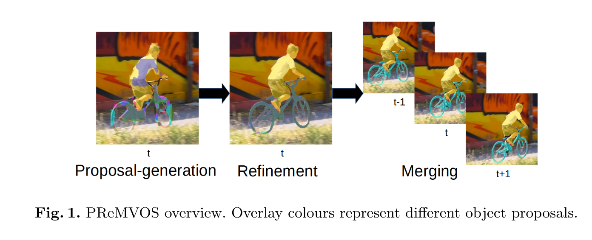
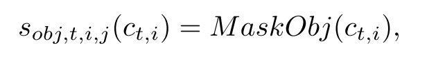
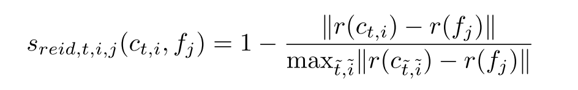
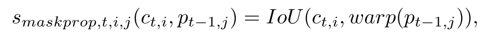
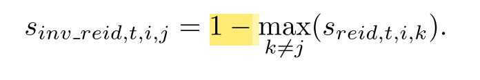
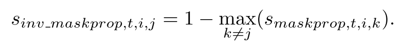
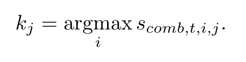
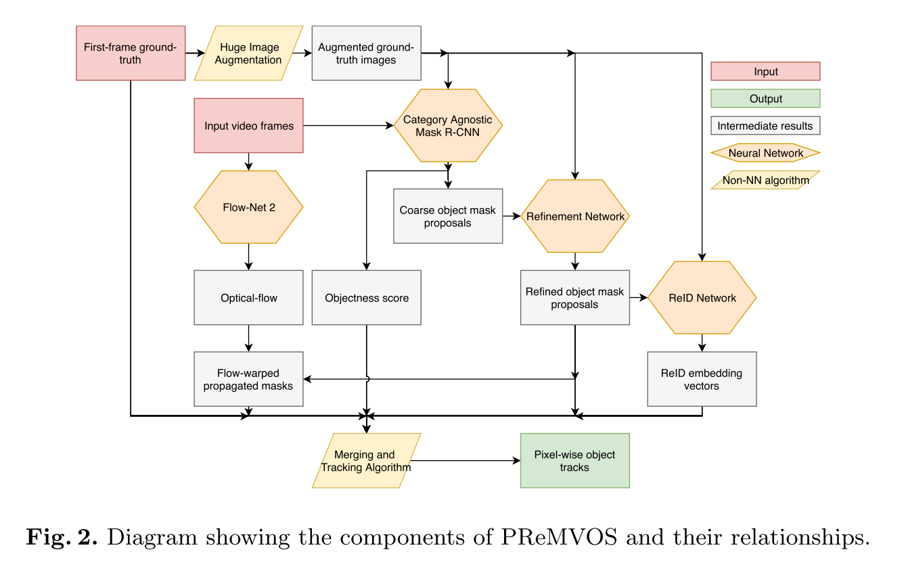

## PReMVOS: Proposal-generation, Refinement and Merging for Video Object Segmentation

### Abstract

------

* Probelm: 

  **Semi-supervised video object segmentation：**

  **(the ground truth mask for the first video frame is given)**

  The task of automatically generating accurate and consistent pixel masks for multiple objects in a video sequence, given the first-frame ground truth annotations.

* Method: 

  Present the **PReMVOS algorithm** (Proposal- generation, Refinement and Merging for Video Object Segmentation)

* Results:  **J&F mean score of 74.7** on the test-challenge dataset DAVIS 2018

### Introduction (**PReMVOS algorithm** Overview) 

------

1. generating **coarse object proposals** using a Mask R-CNN like object detector

2. a **refinement** network that produces accurate pixel masks for each proposal. 

3. **select and link these proposals over time** using a **merging algorithm** that takes into account an objectness score, the optical flow warping, a Re-ID feature embedding vector, and spatial constraints for each object proposal. 

   

### Approach

***

1. **Image Augmentation**: 

   generate a set of 2500 augmented images using the first-frame ground truth, using Lucid Data Dreaming method.

2. **Proposal Generation**: 

   each image in the video sequence → **Mask R-CNN** → coarse mask proposals, bounding boxes, and objectness scores 

3. **Proposal Refinement**: 

   bounding box above (discarding the coarse mask itself) → **FCN** → accurate object segmentation 

4. **Optical Flow**: 

   use the optical flow between successive image pairs to warp a proposed mask into the next frame, to calculate the temporal consistency between two mask proposals. 

   We calculate the Optical Flow using **FlowNet 2.0**

5. **ReID Embedding Vectors**：

   use a triplet-loss based ReID embedding network **(ResNet variant)** to calculate a ReID embedding vector for each mask proposal. 

   learn an embedding space in which crops of different classes are separated and crops of the same class are grouped together.

6. **Merging Algorithm**:

   Build tracks for each frame, track score: an affine combination of **five** separate sub-scores, each with values between 0 and 1.

   1. **Objectness score** for j-th track of the i-th proposal Ct,i at time t, provided by the Proposal Gen- eration network

      

   2. **ReID score,** calculated using the Euclidean distance between the first-frame ground truth ReID embedding vector r(fj) and the ReID embedding vector *r(Ct,i)* of the current mask proposal, where r(·) is the ReID network, and fj is the bounding box of the j-th ground truth object in the first frame.  The complement is then taken to convert from a distance into a similarity score.

   3. **Mask Propagation score:** IoU between the current mask proposal *Ct,i* and the warped proposal *warp(Pt-1,j)* that was decided for in the previous time-step *t-1* for this object track *j,* warped into the current time-step using the optical flow
      

   4. **Inverse ReID score**. 1- maximum ReID score for the current mask proposal and all other object tracks *k* except the object track of interest *j*:

   5. **Inverse Mask Propagation score**. 1 - maximum Mask Propagation IoU score for the current mask proposal and all other object tracks k except the object track of interest j:

   6. All five scores are combined together by an affine combination of **five** separate sub-scores.

   7. The greedy decisions are then made by *Pt,j = Ct,kj* , where kj is the index of the mask proposal with highest track score

      

